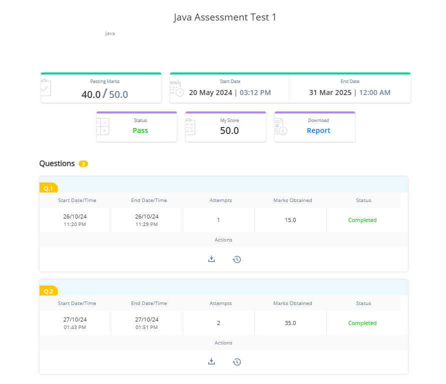

### Question 1 - Average Value

Write main method in Solution class.

In the main method  read five values for an integer array and two int value which are the limits (limit1 and limit2). The main method should print the average of integer values which are greater than limit1 and limit2.

For example: if the values are 1, 2, 3, 4, 5 and the limits are 2 and 6 then the average is 4 ((3+4+5)/3). The output should be in the format of sample output.

Note: The returned average value should be of int data type.

**Sample Input1:**

```
1
2
3
4
5
2
6
```

**Output:**

```
4
```

**Sample Input2:**

```
100
200
300
400
500
100
500
```

**Output**:

```
300
```

---

Sample code snippet for reference:

Please use below code to build your solution.

---

```java
public class Solution
{
	public static void main(String[] args)
	{

		// code to read values
		// code to display the result
	}
}
```

**Instruction:**

Kindly mention class name at **MyClass**

#### Code
```java
package Question1;  
  
import java.util.*;  
public class Solution {  
    public static void main(String[] args) {  
        Scanner scan = new Scanner(System.in);  
        int[] arr = new int[5];  
        for(int i=0;i<5;i++)  
        {  
            arr[i]=scan.nextInt();  
        }  
        int limit1=scan.nextInt();  
        int limit2=scan.nextInt();  
        int values=0,count=0;  
        for(int i=0;i<5;i++){  
            if(arr[i]>limit1 && arr[i]<limit2){  
                values+=arr[i];  
                count++;  
            }  
        }  
        System.out.println(values / count);  
    }  
}
```


----

---


### Question 2 - Player Problem


Create a class Player with below attributes:
* playerId  -  int
* playerName – String
* run – int
* playerType – String
* matchType – String

The above attributes should be private, write getters, setters and parameterized constructor as required.

Create class Solution with main method.

Implement two static methods – `findPlayerWithLowestRuns` and `findPlayerByMatchType` in Solution Class.

`findPlayerWithLowestRuns` method:

- This method will take array of Player objects and a String value as input parameters.
- The method will return the least runs of the Player from array of Player objects for the given player type (String parameter passed).
- If no Player with the above condition are present in array of Player objects, then the method should return 0.

`findPlayerByMatchType` method:

- This method will take array of Player objects and String value as input parameters and return the array of Player objects belonging to the match type passed as input parameters in Descending order of `playerId`.
- If no Player with the above condition are present in the array of Player objects, then the method should return null.

Note: No two Players will have the same `playerId` and runs. All the searches should be case insensitive.

The above method static methods should be called from the main method.

For `findPlayerWithLowestRuns` method -  The main method should print the returned runs as it is if the returned value is greater than 0 or it should print “No such player”

```
E.g.: 25
Where 25 is the lowest runs of the Player.
```


For `findPlayerByMatchType` – The main method should print the `playerId` from the returned Player array for each Player if the returned value is not null.

If the returned value is null then it should print “No Player with given matchType”.

```
E.g.:
13
11
Where 13 and 11 are the playerId’s.
```


Before calling these static methods in main, use Scanner object to read the values of four Player objects referring attributes in the above-mentioned attribute sequence.

Next, read the values of two String parameter for capturing player type and match Type.

Consider below sample input and output:

**Input1:**
```
11
Sachin
100
International
One day
12
Shewag
133
International
Test
13
Varun
78
State
Test
14
Ashwin
67
State
One day
State
One Day
```

**Output:**
```
67
14
11
```


**Input2:**
```
11
Sachin
100
International
One day
12
Shewag
133
International
Test
13
Varun
78
State
Test
14
Ashwin
67
State
One day
District
T20
```


**Output:**
```
No such player
No Player with given matchType
```

---

Sample code snippet for reference:

Please use below code to build your solution.

---

```java
import java.util.Scanner;

public class Solution
{
	public static void main(String[] args)
	{
		// code to read values
		// code to display the result
}
	// code the first method
	// code the second method.
}
// code the class
```

---

**Note on using Scanner object:**

Sometimes scanner does not read the new line character while invoking methods like `nextInt()`, `nextDouble()` etc.

Usually , this is not an issue but this may be visible while calling `nextLine()` immediately after those methods.

Consider below input values:
```
1001
Savings
```

Referring below code:

```
Scanner sc=new Scanner([System.in](http://System.in));
int x=sc.nextInt();
String str=sc.nextLine() -> here we expect str to have value Savings Instead it may be “”
```

If above issue is observed, then it is suggested to add one more explicit call to `nextLine()` after reading numeric value.


**Instruction:**
Kindly mention class name at **MyClass**


#### Code
```java
package Question2;  
  
import java.util.*;  
public class Solution {  
    public static void main(String[] args) {  
        Scanner scan = new Scanner(System.in);  
        Player[] players = new Player[4];  
        for (int i = 0; i < 4; i++) {  
            int playerId = scan.nextInt();  
            scan.nextLine();  
            String playerName = scan.nextLine();  
            int runs = scan.nextInt();  
            scan.nextLine();  
            String playerType = scan.nextLine();  
            String matchType = scan.nextLine();  
            players[i] = new Player(playerId, playerName, runs, playerType, matchType);  
        }  
        String givenPlayerType=scan.nextLine();  
        String givenMatchType=scan.nextLine();  
        int LowestRuns=findPlayerWithLowestRuns(players,givenPlayerType);  
        if(LowestRuns!=0){  
            System.out.println(LowestRuns);  
        } else{  
            System.out.println("No such player");  
        }  
        Player[] matchedPlayer = findPlayerByMatchType(players, givenMatchType);  
        if (matchedPlayer != null) {  
            for(int i=0;i<matchedPlayer.length;i++){  
                System.out.println(matchedPlayer[i].getPlayerId());  
            }  
        }  
        else{  
            System.out.println("No player with given matchType");  
        }  
        scan.close();  
    }  
    public static int findPlayerWithLowestRuns(Player[] players, String givenPlayerType){  
        int leastRuns=Integer.MAX_VALUE;  
        for(Player ps: players){  
            if(ps.getPlayerType().equalsIgnoreCase(givenPlayerType)) {  
                leastRuns = Math.min(leastRuns, ps.getRuns());  
            }  
        }  
        if(leastRuns==Integer.MAX_VALUE){  
            return 0;  
        }  
        return leastRuns;  
    }  
    public static Player[] findPlayerByMatchType (Player[]players, String givenMatchType){  
        ArrayList<Player> matchedPlayer = new ArrayList<>();  
        for (Player ps : players) {  
            if (ps.getMatchType().equalsIgnoreCase(givenMatchType)) {  
                matchedPlayer.add(ps);  
            }  
        }  
        if (matchedPlayer.isEmpty()) {  
            return null;  
        }  
        matchedPlayer.sort(Comparator.comparing(Player::getPlayerId).reversed());  
        return matchedPlayer.toArray(new Player[0]);  
    }  
}  
  
class Player {  
        private int playerId;  
        private String playerName;  
        private int runs;  
        private String playerType;  
        private String matchType;  
  
        public Player(int playerId, String playerName, int runs, String playerType, String matchType) {  
            this.playerId = playerId;  
            this.playerName = playerName;  
            this.runs = runs;  
            this.playerType = playerType;  
            this.matchType = matchType;  
        }  
        public int getPlayerId() {  
            return playerId;  
        }  
        public void setPlayerId(int playerId) {  
            this.playerId = playerId;  
        }  
        public String getPlayerName() {  
            return playerName;  
        }  
        public void setPlayerName(String playerName) {  
            this.playerName = playerName;  
        }  
        public int getRuns() {  
            return runs;  
        }  
        public void setRuns(int runs) {  
            this.runs = runs;  
        }  
        public String getPlayerType() {  
            return playerType;  
        }  
        public void setPlayerType(String playerType) {  
            this.playerType = playerType;  
        }  
        public String getMatchType() {  
            return matchType;  
        }  
        public void setMatchType(String matchType) {  
            this.matchType = matchType;  
        }  
}
```


#### Result:

