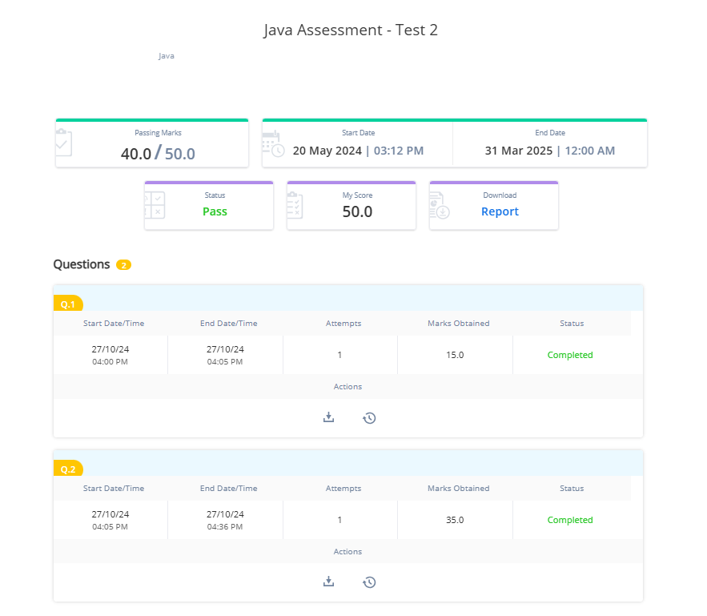

### Question 1 - Multiple of 3

Write main method in Solution class.

In the main method , read an Integer (containing only numeric digits without decimal and special characters) and check whether the sum of its digits is in multiple of 3.

If the given input is in multiple of 3, then print TRUE (as a String) else print FALSE(as a String).

For example: if the given value is 333, 3+3+3 is 9. which is multiple of 3, hence TRUE has to printed.


**Sample Input1:**

```
333
```

**Output:**

```
TRUE
```

**Sample Input2:**

```
200
```

**Output**:

```
FALSE
```

---

Sample code snippet for reference:

Please use below code to build your solution.

---

```java
public class Solution
{
	public static void main(String[] args)
	{

		// code to read values
		// code to display the result
	}
}
```

**Instruction:**

Kindly mention class name at **MyClass**

#### Code
```java
package Question1;  
  
import java.util.*;  
public class MyClass {  
    public static void main(String[] args) {  
        Scanner scan = new Scanner(System.in);  
        int num = scan.nextInt();  
        int sum = 0;  
        while (num > 0) {  
            int digit = num % 10;  
            sum += digit;  
            num /= 10;  
        }  
        if (sum % 3 == 0) {  
            System.out.println("TRUE");  
        } else {  
            System.out.println("FALSE");  
        }  
    }  
}
```


----

---


### Question 2 - Laptop Problem


Create a class Laptop with below attributes:
* laptopId - int
* brand - String 
* osType - String
* price - double
* rating - int


The above attributes should be private, write getters, setters and parameterized constructor as required.

Create class Solution with main method.

Implement two static methods – `countOfLaptopsByBrand` and `searchLaptopByOsType` in Solution Class.

`countOfLaptopsByBrand` method:

- This method will take two input parameters - array of Laptop objects and a String parameters.
- The method will return the count of laptops from array of Laptop objects for the given Laptop type (String parameter passed) whose rating is more than 3.
- If no Laptop with the above condition is present in array of Laptop objects, then the method should return 0.

`searchLaptopByOsType` method:

- This method will take two input parameters - array of Laptop objects and a String parameter.
- The method will return the Laptop object array in an descending order of their `laptopId`, from the array of Laptop objects whose `os` attribute matches with the given OS (String parameter passed)
- If no Laptop with the given OS is present in the array of Laptop objects, then the method should return null.

Note: No two Laptops will have the same `laptopId` and runs. All the searches should be case insensitive.

The above method static methods should be called from the main method.

For `countOfLaptopsByBrand` method -  The main method should print the count of laptops as it is, if the returned value is greater than 0 or it should print “The given brand is not available”

For `searchLaptopByOsType` – The main method should print the `laptopId`  and `rating` from the returned Laptop object array if the returned value is not null.

If the returned value is null then it should print “The given os is not available".

Before calling these static methods in main, use Scanner object to read the values of Four Laptop objects referring attributes in the above-mentioned attribute sequence.

Next, read two String values for capturing brand and os.

Consider below sample input and output:

**TestCase1**:

**Input1:**
```
123
HP
Windows
35000
5
124
Apple
Mac OS
70000
5
125
Dell
Ubuntu
30000
4
126
HP
Windows
40000
4
HP
Windows
```

**Output1**:
```
2
126
4
123
5
```


**TestCase2**:

**Input1:**
```
123
HP
Windows
35000
5
124
Apple
Mac OS
70000
5
125
Dell
Ubuntu
30000
4
126
HP
Windows
40000
4
HP1
Ubuntu1
```

**Output1**:
```
The given brand is not available
The given os is not available
```


---

Sample code snippet for reference:

Please use below code to build your solution.

---

```java
import java.util.Scanner;

public class Solution
{
	public static void main(String[] args)
	{
		// code to read values
		// code to display the result
	}
	// code the first method
	// code the second method.
}
// code the class
```

---

**Note on using Scanner object:**

Sometimes scanner does not read the new line character while invoking methods like `nextInt()`, `nextDouble()` etc.

Usually , this is not an issue but this may be visible while calling nextLine() immediately after those methods.

Consider below input values:
```
1001
Savings
```

Referring below code:

```
Scanner sc=new Scanner([System.in](http://System.in));
int x=sc.nextInt();
String str=sc.nextLine() -> here we expect str to have value Savings Instead it may be “”
```

If above issue is observed, then it is suggested to add one more explicit call to `nextLine()` after reading numeric value.


**Instruction:**
Kindly mention class name at **MyClass**


#### Code
```java
package Question2;  
  
import java.util.*;  
public class MyClass {  
    public static void main(String[] args) {  
        Scanner scan = new Scanner(System.in);  
        Laptop[] laptops = new Laptop[4];  
        for(int i=0;i<4;i++){  
            int laptopId=scan.nextInt();  
            scan.nextLine();  
            String brand=scan.nextLine();  
            String osType=scan.nextLine();  
            double price=scan.nextDouble();  
            int rating=scan.nextInt();  
            laptops[i]=new Laptop(laptopId,brand,osType,price,rating);  
        }  
        scan.nextLine();  
        String givenBrand=scan.nextLine();  
        String givenOsType=scan.nextLine();  
  
        int countLaptop=countOfLaptopsByBrand(laptops,givenBrand);  
        if(countLaptop!=0){  
            System.out.println(countLaptop);  
        }  
        else{  
            System.out.println("The given brand is not available");  
        }  
        Laptop[] searchedLaptops=searchLaptopByOsType(laptops,givenOsType);  
        if(searchedLaptops!=null){  
            for(int i=0;i<searchedLaptops.length;i++){  
                System.out.println(searchedLaptops[i].getLaptopId());  
                System.out.println(searchedLaptops[i].getRating());  
            }  
        }  
        else{  
            System.out.println("The given os is not available");  
        }  
    }  
    public static int countOfLaptopsByBrand(Laptop[] laptops, String givenBrand){  
        int countLaptop=0;  
        for(Laptop ls: laptops){  
            if(ls.getBrand().equalsIgnoreCase(givenBrand) && ls.getRating()>3){  
                countLaptop++;  
            }  
        }  
        return countLaptop;  
    }  
    public static Laptop[] searchLaptopByOsType(Laptop[] laptops, String givenOsType) {  
        ArrayList<Laptop> searchedLaptop = new ArrayList<>();  
        for (Laptop ls: laptops) {  
            if (ls.getOsType().equalsIgnoreCase(givenOsType)) {  
                searchedLaptop.add(ls);  
            }  
        }  
        if (searchedLaptop.isEmpty()) {  
            return null;  
        }  
        searchedLaptop.sort(Comparator.comparing(Laptop::getLaptopId).reversed());  
        return searchedLaptop.toArray(new Laptop[0]);  
    }  
}  
class Laptop {  
    private int laptopId;  
    private String brand;  
    private String osType;  
    private double price;  
    private int rating;  
  
    public Laptop(int laptopId, String brand, String osType, double price, int rating) {  
        this.laptopId = laptopId;  
        this.brand = brand;  
        this.osType = osType;  
        this.price = price;  
        this.rating = rating;  
    }  
  
    public int getLaptopId() {  
        return laptopId;  
    }  
  
    public void setLaptopId(int laptopId) {  
        this.laptopId = laptopId;  
    }  
  
    public String getBrand() {  
        return brand;  
    }  
  
    public void setBrand(String brand) {  
        this.brand = brand;  
    }  
  
    public String getOsType() {  
        return osType;  
    }  
  
    public void setOsType(String osType) {  
        this.osType = osType;  
    }  
  
    public double getPrice() {  
        return price;  
    }  
  
    public void setPrice(double price) {  
        this.price = price;  
    }  
  
    public int getRating() {  
        return rating;  
    }  
  
    public void setRating(int rating) {  
        this.rating = rating;  
    }  
}
```


#### Result:

