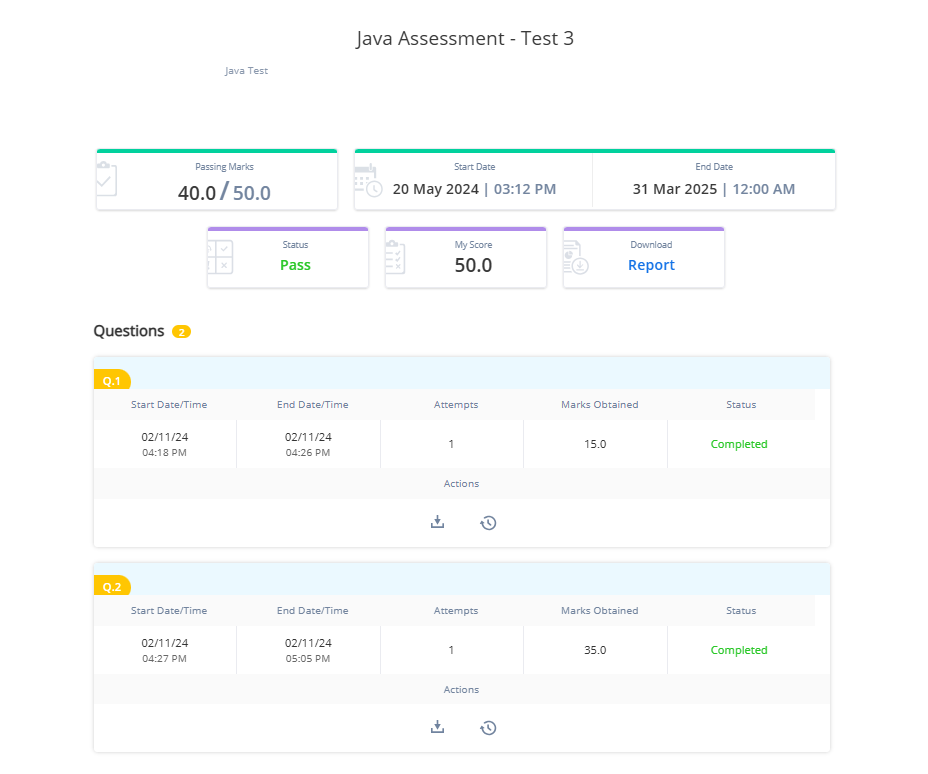

### Question 1 - Sum of Odd Integer in an Array

Write main method in Solution class.

In the main method, read five values for an integer array. The main method should print the sum of odd numbers from the array of integers only if the sum value is greater than 8 and less than 50. Else it should print "NA".

For example: if the values are `1, 2, 3, 5, 7` the sum of odd numbers should be printed as 16. As in the array - `1, 3, 5, 7` are odd numbers so their sum is `16(1 + 3 + 5 + 7)` which is **greater than 8 and less than 50**. The output should be in the format of sample output.

Note: Sum of integers is based on their sign (+ or -)

Example: If two numbers are 11 and -18, their sum will be -7.


**Sample Input1:**

```
1
2
3
5
7
```

**Output:**

```
Sum of odd numbers: 16
```

**Sample Input2:**

```
1
2
3
4
8
```

**Output**:

```
NA
```

---

Sample code snippet for reference:

Please use below code to build your solution.

---

```java
public class Solution
{
	public static void main(String[] args)
	{

		// code to read values
		// code to display the result
	}
}
```

**Instruction:**

Kindly mention class name at **MyClass**

#### Code
```java
package Question1;  
  
  
import java.util.*;  
public class MyClass {  
    public static void main(String[] args) {  
        Scanner scan = new Scanner(System.in);  
        int[] arr = new int[5];  
        for(int i=0;i<5;i++) {  
            arr[i]=scan.nextInt();  
        }  
        int sum=0;  
        for(int i=0;i<5;i++){  
            if(arr[i]%2!=0){  
                sum+=arr[i];  
            }  
        }  
        if(sum>8 && sum<50){  
            System.out.println("Sum of odd numbers: "+sum);  
        }  
        else{  
            System.out.println("NA");  
        }  
    }  
}
```


----

---


### Question 2 - Hotel Problem

Create a class Hotel with the below attributes:

hotelId - int
hotelName - String
dateOfBooking – String (in the format dd-mon-yyyy)
noOfRoomsBooked – int
wifiFacility – String
totalBill- double


The above attributes should be private, write getters, setters and parameterized constructor as required.

Create class Solution with main method.

Implement two static methods – `noOfRoomsBookedInGivenMonth` and `searchHotelByWifiOption `in Solution class.

`noOfRoomsBookedInGivenMonth` method:
* This method will take two input parameter - array of Hotel objects and a String parameter.
* The method will return the total numbers of rooms booked from array of Hotel objects for the given month (String parameter passed).
* If no rooms are booked for the given month in the array of Hotel objects, then the method should return 0.


`searchHotelByWifiOption` method:
* This method will take two input parameter - array of Hotel objects and a String parameter
* The method will return Hotel object with second highest totalbill, from the array of Hotel objects where wifiFacility String matches with the given wififacility(String parameter passed).
* If no Hotel with the given wifi option is present in the array of Hotel objects, then the method should return null.

Note :
* No two Hotel object would have the same hotelId.
* No two Hotel object would have the same totalbill.
* The Array either has at least two objects with specified wifi option OR  no object with specified wifi option.
* All the searches should be case insensitive.
* dateOfBooking is stored in the format dd-mon-yyyy(eg. 01-Jan-2022)

The above mentioned static methods should be called from the main method.

For `noOfRoomsBookedInGivenMonth` method - 
The main method should print the total number of booked rooms as it is,
if the returned value is greater than 0, else it should print "No rooms booked in the given month"

For `searchHotelByWifiOption` method -
The main method should print the hotelId from the returned Hotel object if the returned value is not null.
If the returned value is null then it should print "No such option available".

Before calling these static methods in main, use Scanner object to read the values of four Hotel objects referring attributes in the above mentioned attribute sequence.

Next, read the value of two String parameters for capturing the month and wifi option .


Consider below sample input and output:


**TestCase1**:

**Input:**
```
101
Best Stay
01-Jan-2022
10
Yes
20000
102
Apple Stay
12-Feb-2022
3
Yes
4000
103
Accord
11-May-2022
5
Yes
15000
104
Royal Park
22-Dec-2021
7
Yes
12000
May
Yes
```

**Output*:
```
5
103
```


**TestCase2**:

**Input:**
```
101
Best Stay
01-Jan-2022
10
Yes
20000
102
Apple Stay
12-Feb-2022
3
Yes
4000
103
Accord
11-May-2022
5
Yes
15000
104
Royal Park
22-Dec-2021
7
Yes
12000
May1
Yes1
```

**Output*:
```
No rooms booked in the given month
No such option available
```


---

Sample code snippet for reference:

Please use below code to build your solution.

---

```java
import java.util.Scanner;

public class Solution
{
	public static void main(String[] args)
	{
		// code to read values
		// code to display the result
	}
	// code the first method
	// code the second method.
}
// code the class
```

---

**Note on using Scanner object:**

Sometimes scanner does not read the new line character while invoking methods like `nextInt()`, `nextDouble()` etc.

Usually , this is not an issue but this may be visible while calling nextLine() immediately after those methods.

Consider below input values:
```
1001
Savings
```

Referring below code:

```
Scanner sc=new Scanner([System.in](http://System.in));
int x=sc.nextInt();
String str=sc.nextLine() -> here we expect str to have value Savings Instead it may be “”
```

If above issue is observed, then it is suggested to add one more explicit call to `nextLine()` after reading numeric value.


**Instruction:**
Kindly mention class name at **MyClass**


#### Code
```java
package Question2;  
  
import java.util.*;  
  
public class MyClass {  
    public static void main(String[] args) {  
        Scanner scan=new Scanner(System.in);  
        Hotel[] hotels=new Hotel[4];  
        for(int i=0;i<4;i++){  
            int hotelId=scan.nextInt();  
            scan.nextLine();  
            String hotelName=scan.nextLine();  
            String dateOfBooking=scan.nextLine();  
            int noOfRoomsBooked=scan.nextInt();  
            scan.nextLine();  
            String wifiFacility=scan.nextLine();  
            double totalBill=scan.nextDouble();  
  
            hotels[i]=new Hotel(hotelId,hotelName,dateOfBooking,noOfRoomsBooked,wifiFacility,totalBill);  
        }  
        scan.nextLine();  
        String givenMonth=scan.nextLine();  
        String wifi=scan.nextLine();  
  
        int totalRoomsBooked=noOfRoomsBookedInGivenMonth(hotels,givenMonth);  
        if(totalRoomsBooked>0){  
            System.out.println(totalRoomsBooked);  
        }  
        else{  
            System.out.println("No rooms booked in the given month");  
        }  
  
        Hotel hotelByWifiOption=searchHotelByWifiOption(hotels,wifi);  
        if(hotelByWifiOption!=null){  
            System.out.println(hotelByWifiOption.getHotelId());  
        }  
        else{  
            System.out.println("No such option available");  
        }  
    }  
    public static int noOfRoomsBookedInGivenMonth(Hotel[] hotels, String givenMonth){  
        int totalRooms=0;  
        for(Hotel ht: hotels){  
  
            if(ht.getDateOfBooking().contains(givenMonth)){  
                totalRooms+=ht.getNoOfRoomsBooked();  
            }  
        }  
        return totalRooms;  
    }  
    public static Hotel searchHotelByWifiOption(Hotel[] hotels, String wifi){  
        ArrayList<Hotel> highestByWifiOption=new ArrayList<>();  
        for(Hotel ht: hotels){  
            if(ht.getWifiFacility().equalsIgnoreCase(wifi)){  
                highestByWifiOption.add(ht);  
            }  
        }  
        if(highestByWifiOption.isEmpty()){  
            return null;  
        }  
        highestByWifiOption.sort(Comparator.comparing(Hotel:: getTotalBill).reversed());  
  
        return highestByWifiOption.get(1);  
    }  
}  
  
  
class Hotel{  
    private int hotelId;  
    private String hotelName;  
    private String dateOfBooking;  
    private int noOfRoomsBooked;  
    private String wifiFacility;  
    private double totalBill;  
  
    public Hotel(int hotelId, String hotelName, String dateOfBooking, int noOfRoomsBooked, String wifiFacility, double totalBill) {  
        this.hotelId = hotelId;  
        this.hotelName = hotelName;  
        this.dateOfBooking = dateOfBooking;  
        this.noOfRoomsBooked = noOfRoomsBooked;  
        this.wifiFacility = wifiFacility;  
        this.totalBill = totalBill;  
    }  
  
    public int getHotelId() {  
        return hotelId;  
    }  
  
    public void setHotelId(int hotelId) {  
        this.hotelId = hotelId;  
    }  
  
    public String getHotelName() {  
        return hotelName;  
    }  
  
    public void setHotelName(String hotelName) {  
        this.hotelName = hotelName;  
    }  
  
    public String getDateOfBooking() {  
        return dateOfBooking;  
    }  
  
    public void setDateOfBooking(String dateOfBooking) {  
        this.dateOfBooking = dateOfBooking;  
    }  
  
    public int getNoOfRoomsBooked() {  
        return noOfRoomsBooked;  
    }  
  
    public void setNoOfRoomsBooked(int noOfRoomsBooked) {  
        this.noOfRoomsBooked = noOfRoomsBooked;  
    }  
  
    public String getWifiFacility() {  
        return wifiFacility;  
    }  
  
    public void setWifiFacility(String wifiFacility) {  
        this.wifiFacility = wifiFacility;  
    }  
  
    public double getTotalBill() {  
        return totalBill;  
    }  
  
    public void setTotalBill(double totalBill) {  
        this.totalBill = totalBill;  
    }  
}

```


#### Result:


